# **HSH Sales System (2026)**

## **Backend Architecture, Workflow & Implementation Blueprint**

A **field‑first LPG sales and logistics system** for Singapore operations, designed to safely digitize **physical asset movement, billing, and proof of delivery** under unreliable connectivity and regulatory scrutiny.

---

## **1. Architectural Philosophy: Backend as Physical Truth**

In LPG distribution, software does not merely *describe* reality — it **defines accountability for physical assets**.

Every cylinder collected, delivered, returned, billed, or serviced represents:

* monetary value
* regulated inventory
* contractual obligation
* audit liability

The HSH Sales System is therefore built around a single, non‑negotiable mandate:

> **The backend is the authoritative source of truth for all physical and financial state.**

This is not an ideological stance. It is a **risk‑containment strategy**.

Unlike purely digital systems, LPG operations manage reusable, high‑value assets that physically traverse **depots, trucks, and customer sites**. Any ambiguity between physical reality and digital state rapidly manifests as revenue leakage, stock disputes, customer conflict, and regulatory exposure.

For this reason, the backend is intentionally:

* conservative
* explicit
* transactionally strict
* auditable by design

---

## **1.1 Field‑First Architecture as an Explicit Risk Model**

Field staff routinely operate in environments where poor connectivity is the norm:

* industrial estates
* basements and service corridors
* roadside delivery points
* customer back‑of‑house areas

Designing for “always‑online” behavior introduces silent failure modes:

* dropped inventory updates
* duplicated transactions
* unverifiable cylinder movements
* delayed or missing invoices

The system therefore assumes:

> **Offline‑first operation is the baseline. Connectivity is an optimization.**

All data must be:

* captured immediately at the point of physical action
* safely queued on device
* reconciled deterministically under backend authority once connectivity resumes

---

## **1.2 Backend Discipline in Physical Operations**

Ambiguity is operationally and financially unacceptable.

The backend must therefore:

* enforce **explicit ownership** of every state transition
* reject partial, implicit, or ambiguous commits
* provide **immutable, timestamped evidence** for every action

This discipline directly informs the system’s layering, transaction boundaries, locking strategy, intent‑based APIs, and audit model.

---

## **2. Core Users & Operational Goals**

### **Primary Users**

* Delivery drivers
* Field sales staff
* Tablets paired with mobile thermal printers

### **Operational Goals (Priority‑Ordered)**

1. Record cylinder movements (Depot ↔ Truck)
2. Deliver cylinders, read meters, perform services
3. Generate **correct invoices immediately**
4. Print invoices on‑site
5. Auto‑email PDF invoices
6. Track cylinder location (Depot / Truck / Client Site)
7. Track invoice lifecycle: **Generated → Printed → Emailed → Paid**

---

## **3. Canonical Workflows (Architecturally Distinct)**

| Workflow     | Purpose                                 | Customer | Invoice | Print            | Email | Cylinder Tracking |
| ------------ | --------------------------------------- | -------- | ------- | ---------------- | ----- | ----------------- |
| Distribution | Depot ↔ Truck logistics                 | No       | No      | Optional receipt | No    | Depot inventory   |
| Transaction  | Customer sale / usage / service billing | Yes      | Yes     | Invoice          | Yes   | Client inventory  |

These workflows are **deliberately separated** and must never be conflated in code or data models.

---

## **4. Technical Foundation & Stack Rationale (2026)**

The stack prioritizes **predictability, transactional safety, and longevity**.

### **Runtime & Framework**

* Python 3.12
* Django 6 (LTS)
* Django REST Framework 3.15+

### **Persistence & Integrity**

* MySQL 8 (production — ACID, row‑level locking)
* SQLite (local development)

### **Infrastructure Services**

* JWT authentication (`simplejwt`)
* OpenAPI documentation (`drf‑spectacular`)
* WeasyPrint (HTML → PDF)
* SMTP (invoice delivery)

---

## **5. Strict Layered Backend Architecture**

```
Client (Mobile / Web)
        ↓
API Layer (ViewSets – intent only)
        ↓
Serializer Layer (validation & reconciliation)
        ↓
Service Layer (business authority)
        ↓
Domain Models (committed state)
        ↓
Database (ACID, row‑locked on commit)
```

Each layer has a single responsibility and an explicit prohibition list. Logic leakage is treated as an architectural defect.

---

## **6. Domain‑Aligned Django Application Structure**

* **accounts/** — identities, roles, JWT lifecycle
* **depots/**, **equipment/** — physical asset registry
* **distribution/** — internal logistics (Depot ↔ Truck)
* **transactions/**, **invoices/** — billing and invoicing engine
* **inventory/** — depot, truck, and client stock
* **audit/** — immutable append‑only activity ledger

This structure ensures no domain can bypass inventory control or audit enforcement.

---

## **7. Data Model Authority (ERD Summary)**


* Distribution: `DistributionHeader` → `DistributionItem` → atomic `Inventory` updates
* Transactions: `TransactionHeader` → `TransactionItem` → `Invoice`
* Client inventory updated atomically
* Invoice lifecycle tracked explicitly

Models represent **physical reality**, not UI convenience.

---

## **8. Serializer Layer: Validation & Offline Reconciliation**

Serializers are **gatekeepers**, not decision‑makers.

They:

* validate structure and enums
* normalize offline payloads
* accept `client_temp_id`

They must never:

* mutate inventory
* calculate prices
* finalize state

### **Offline Reconciliation Rules**

* server timestamps override client time
* backend assigns authoritative IDs
* conflict resolution: **Last‑Write‑Wins**
* CRDT intentionally rejected for audit clarity and MVP constraints

---

## **9. Service Layer: Business Authority**

The service layer is the **only place where reality changes**.

### **Responsibilities**

* inventory mutation
* billing calculation
* lifecycle transitions
* document generation
* notifications
* audit creation

> Views delegate. Serializers validate. **Services decide.**

### **Atomic Guarantees**

* `@transaction.atomic`
* row‑level locking on inventory
* no partial commits
* no negative stock
* no concurrent double‑claims

---

## **10. API Layer: Intent‑Based State Transitions**

Drafting uses CRUD. Finalization requires explicit intent:

```
POST /api/v1/transactions/{id}/confirm/
POST /api/v1/distributions/{id}/confirm/
```

Only confirm endpoints may lock inventory, finalize billing, generate invoices, and write audit records.

---

## **11. End‑to‑End Operational Flow**

Frontend → Offline Queue → Backend Services → MySQL → Audit → Print / Email

Properties:

* mandatory human confirmation
* offline queueing
* atomic backend commit
* immediate physical + digital proof
* immutable audit trail

---

## **12. Audit as Forensic Evidence**

Audit records capture user, action, entity, payload snapshot, and authoritative timestamp.

Audit logs are append‑only, immutable, and read‑only — even to administrators.

---

## **13. Hardware Boundary & Document Generation**

Backend:

* generates facts
* renders PDFs
* produces ESC/POS payloads

Frontend:

* controls Bluetooth printers
* manages physical interaction

---

## **14. Offline Sync & Conflict Strategy**

* offline queue mandatory
* server time authoritative
* Last‑Write‑Wins consistently applied

This is a conscious trade‑off prioritizing reliability and audit clarity.

---

## **15. Implementation Roadmap (16 Weeks)**

1. Schema & contracts
2. Auth, inventory, audit
3. Distribution logic
4. Transactions & invoicing
5. Offline sync hardening
6. UAT & deployment

---

## **16. Architectural Takeaways**

1. Physical assets demand backend discipline
2. State transitions must be explicit
3. Offline capability is foundational

The HSH Sales System demonstrates how strict layering, atomic enforcement, and intent‑driven APIs can safely digitize high‑risk, real‑world logistics without sacrificing field usability.

---

## **Appendix A – Sequence Diagrams (Textual Form)**

> These diagrams describe *authoritative backend flows*. UI steps are illustrative; the backend remains the source of truth.

### **A1. Confirm Transaction / Distribution (Atomic Commit)**

**Actors:** Field App → API Gateway → Service Layer → Database → Audit Log

1. Field App submits `/confirm/` intent with payload and `client_temp_id`
2. API Gateway authenticates JWT and routes to ViewSet intent endpoint
3. ViewSet delegates immediately to Service Layer
4. Service Layer opens `@transaction.atomic` block
5. Rows affected (inventory, headers, lines) locked using `SELECT … FOR UPDATE`
6. Business rules validated (stock sufficiency, meter logic, status validity)
7. Inventory counters updated
8. Transaction / Distribution status transitioned to **CONFIRMED**
9. Audit Log entry written **inside the same atomic block**
10. Commit succeeds → database state becomes authoritative
11. API responds with server timestamp and authoritative IDs

**Failure behavior:**

* Any exception → full rollback (no partial stock, no audit record)
* Client retries safely due to idempotent identifiers

---

### **A2. Offline Sync & Reconciliation Flow**

**Actors:** Field App (Offline Queue) → Sync Endpoint → Reconciliation Service → Database

1. Field App stores actions locally with `client_temp_id`
2. Network restored → batch POST to `/sync/`
3. Backend authenticates and iterates payload
4. For each item:

   * If `client_temp_id` already reconciled → ignored (idempotent)
   * Else → processed as new intent
5. Server assigns authoritative IDs and timestamps
6. Last-Write-Wins applied **using server clock only**
7. Response returns mapping of `client_temp_id → server_id`
8. Client purges local queue

**Guarantee:** client timestamps are never authoritative

---

### **A3. Print & Email Invoice Flow**

**Actors:** Field App → API → Invoice Service → PDF Engine → SMTP / Frontend Printer

1. Confirmed transaction triggers invoice generation
2. Service Layer renders HTML invoice
3. WeasyPrint converts HTML → PDF
4. Invoice status transitions: GENERATED → PRINTED / EMAILED
5. Backend returns ESC/POS payload to frontend
6. Frontend handles Web Bluetooth printer connection
7. SMTP email sent asynchronously with PDF attached
8. Audit Log records print/email action

**Separation of concerns:**

* Backend never connects to hardware
* Frontend never mutates invoice state directly

---

## **Appendix B – Data Integrity Guarantees**

### **B1. What the System Explicitly Cannot Do**

By design, the system **cannot**:

* Modify inventory without a confirmed intent
* Change invoice or transaction status via generic CRUD endpoints
* Accept client-side timestamps as authoritative
* Partially commit stock movements
* Generate audit logs for failed operations
* Reconcile the same physical movement twice

Any attempt to do the above is structurally rejected.

---

### **B2. What Is Impossible by Construction**

The architecture makes the following scenarios impossible:

* Inventory mismatch between depot and audit log
* Duplicate confirmed transactions from retries
* “Printed” invoices without a generated PDF
* Silent stock deductions
* Backdated financial records
* Undetectable manual tampering of billing state

These are prevented through:

* Atomic database transactions
* Intent-only state transitions
* Server-time authority
* Immutable audit records

---

## **Appendix C – Architectural Decision Records (ADRs)**

### **ADR-001: Last-Write-Wins (LWW) vs CRDT**

**Decision:** Adopt LWW with manual exception handling

**Rationale:**

* CRDT introduces significant implementation and cognitive overhead
* LPG transactions are low-frequency, high-value
* Human reconciliation is acceptable and auditable

**Consequence:**

* Backend clock is authoritative
* Conflicts are visible, not hidden

---

### **ADR-002: Explicit Confirm Endpoints**

**Decision:** Separate `/confirm/` intent from CRUD operations

**Rationale:**

* Prevents accidental state transitions
* Aligns digital commit with physical action
* Enables row locking and atomic enforcement

**Consequence:**

* Slightly more API surface area
* Significantly higher data integrity

---

### **ADR-003: Hardware-Agnostic Backend**

**Decision:** Backend generates payloads, frontend handles hardware

**Rationale:**

* Printers vary across field deployments
* Backend must remain cloud-portable
* Hardware access is browser / OS dependent

**Consequence:**

* Cleaner separation of concerns
* Backend remains testable and deterministic

---

**End of Architectural Blueprint**

---

## **Appendix D – Plain‑Language System Understanding (Field & Stakeholder View)**

### **D1. Why This System Exists**

The HSH Sales System is not a generic ERP or POS. It exists to solve **real LPG field problems** in Singapore:

* Drivers work in low‑connectivity environments
* Cylinders are regulated, reusable physical assets
* Billing errors create immediate disputes
* Missing proof creates audit and compliance risk

The system is therefore designed to:

* capture actions **at the moment they physically happen**
* prevent accidental or ambiguous commits
* produce **immediate physical + digital proof**
* always know **where every cylinder is**

---

### **D2. Real Users, Real Constraints**

**Primary users** are delivery drivers and field sales staff using:

* Tablets
* Mobile thermal printers
* Unreliable networks

Design assumptions:

* Minimal typing (dropdowns everywhere)
* Fast confirmation screens
* Mandatory human confirmation
* Offline operation by default

---

### **D3. Two Workflows That Must Never Mix**

The system supports **two completely different workflows**:

| Workflow     | What it does                             | Why it exists              |
| ------------ | ---------------------------------------- | -------------------------- |
| Distribution | Moves cylinders between depot and truck  | Pure logistics, no billing |
| Transaction  | Bills customers and updates client stock | Revenue and audit critical |

Mixing these would cause:

* incorrect stock counts
* billing disputes
* audit failures

That is why they are **separate in UI, API, services, and data models**.

---

### **D4. What Happens When a Driver Taps “Confirm”**

Pressing **Confirm** is a **point of no return**.

Behind the scenes:

1. Backend locks all affected inventory rows
2. Business rules are validated
3. Inventory is updated atomically
4. Invoice (if applicable) is generated
5. Audit record is written
6. Database commit finalizes reality

If **any step fails**, nothing is saved.

---

### **D5. Why Printing and Email Are Treated Carefully**

* Printing proves delivery **to the customer**
* Email proves delivery **to the business**

The backend:

* generates the invoice PDF
* records when print/email occurs

The frontend:

* connects to the printer
* handles physical interaction

This separation avoids hardware‑driven data corruption.

---

### **D6. How Cylinder Locations Are Always Known**

Cylinder location is derived **only from confirmed actions**:

| Action               | Result                              |
| -------------------- | ----------------------------------- |
| Confirm Distribution | Cylinders belong to depot inventory |
| Confirm Transaction  | Cylinders belong to client site     |

There is no manual override.

---

### **D7. What the System Protects the Business From**

By design, the system prevents:

* lost cylinders
* duplicated billing
* backdated invoices
* silent stock adjustments
* untraceable actions

Every confirmed action has:

* a user
* a timestamp
* an audit record

---

### **D8. Final Mental Model**

> **If it is not confirmed, it did not happen.**

This single rule keeps physical operations, billing, and audit perfectly aligned.

---

## **Appendix E – API Design Alignment (Architecture → Contract)**

This appendix formally aligns the **Backend Architecture Blueprint** with the **API Design Guide (2026)**, ensuring there is **no semantic gap** between architectural intent and HTTP contracts consumed by frontend, mobile, and QA teams.

---

### **E1. Architectural Rules → API Rules Mapping**

| Architectural Rule                  | API Enforcement                                               |
| ----------------------------------- | ------------------------------------------------------------- |
| Backend is source of physical truth | No endpoint mutates inventory except `/confirm/` intents      |
| Offline-first                       | All POST endpoints accept `client_temp_id`                    |
| Explicit state transitions          | Action endpoints (`/confirm/`) only                           |
| Atomicity                           | Service-layer `@transaction.atomic` behind confirm endpoints  |
| Auditability                        | Every confirm endpoint writes immutable audit records         |
| Hardware agnostic                   | APIs return payloads (PDF, ESC/POS), never connect to devices |

This mapping ensures that **API misuse cannot violate backend invariants**.

---

### **E2. Confirm Endpoints as Legal Commit APIs**

From an API perspective, `/confirm/` endpoints are **not convenience actions** — they are:

* financial commit points
* inventory ownership transfers
* audit boundaries

API guarantees:

* Idempotent execution via unique numbers (`TRX-*`, `DIST-*`)
* Full rollback on any validation or persistence failure
* Server-generated timestamps only

Any future API version **must preserve this semantic meaning**.

---

### **E3. Offline Sync as a First-Class API Concern**

The `/sync/` pattern is not an optimization layer — it is **core system infrastructure**.

API design implications:

* Batch-safe POST handling
* Deterministic replay using `client_temp_id`
* Explicit rejection of partial successes
* Clear reconciliation responses (`client_temp_id → server_id`)

This guarantees that replayed requests cannot corrupt physical or financial state.

---

### **E4. Error Semantics as Business Signals**

Standardized error responses are not cosmetic. They are **operational signals**:

* `400` → field input or business rule violation
* `401 / 403` → identity or authorization failure
* `409` → state conflict (already confirmed, insufficient stock)
* `500` → backend fault (requires investigation)

Frontend behavior must respect these semantics — especially during offline replay.

---

### **E5. API Evolution Constraints**

The following changes are **explicitly disallowed** without a new API version:

* Allowing inventory mutation via PATCH/PUT
* Allowing confirm via bulk generic endpoints
* Accepting client-provided timestamps
* Removing audit payload snapshots

These constraints preserve long-term audit defensibility.

---

### **E6. Final Architectural Alignment Statement**

> **If an API endpoint exists, it exists to enforce — not weaken — backend truth.**

This appendix completes the blueprint by proving that **architecture, implementation, and API contracts form a single coherent system**.

---

**End of Enhanced Architectural Blueprint**
